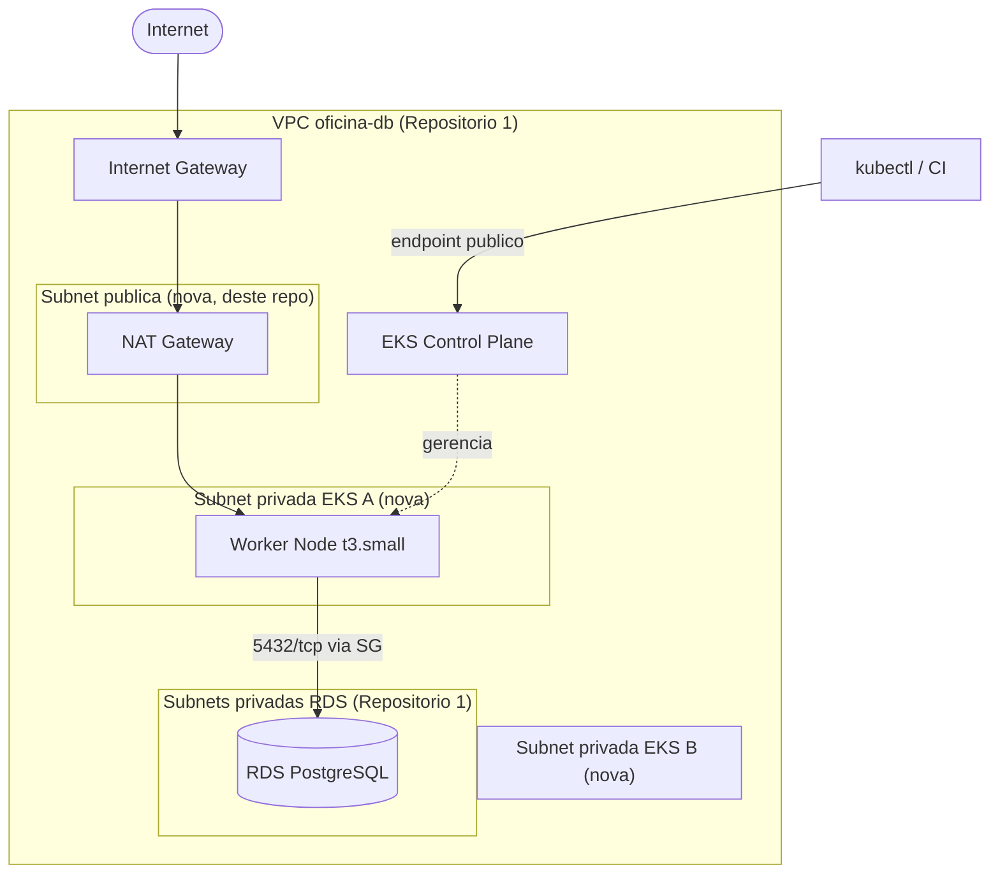

# oficina-k8s-infrastructure

Infraestrutura como código (Terraform) para o cluster **AWS EKS** que hospeda
a aplicação principal do projeto **oficina**. Este é o **Repositório 3** da
Fase 3 do Tech Challenge, dentro da arquitetura de 4 repositórios
independentes:

| # | Repositório | Responsabilidade |
|---|---|---|
| 1 | oficina-db-infrastructure | Banco de dados gerenciado (RDS PostgreSQL) |
| 2 | oficina-lambda-auth | Lambda de autenticação por CPF + API Gateway |
| 3 | **oficina-k8s-infrastructure** (este) | Cluster Kubernetes gerenciado (EKS) |
| 4 | oficina-app | Aplicação NestJS (Clean Architecture/DDD) |

## ⚠️ AVISO DE CUSTO — leia antes de aplicar

O **control plane do EKS custa ~US$0,10/hora (~US$73/mês) fixo**, cobrado
enquanto o cluster existir, independente de uso — **não há free tier para
isso**. Somado ao node (`t3.small`, ~US$15/mês) e ao NAT Gateway
(~US$32/mês + tráfego), o custo total gira em torno de **US$120/mês** rodando
continuamente.

**Recomendação forte**: destrua o cluster quando não estiver em uso/avaliação:

```bash
terraform destroy -var="db_state_bucket=<NOME_DO_BUCKET>"
```

E recrie quando precisar (`terraform apply`) — o provisionamento completo
leva ~15-20 minutos.

## Sumário

- [Propósito](#propósito)
- [Tecnologias](#tecnologias)
- [Topologia](#topologia)
- [Decisões de arquitetura](#decisões-de-arquitetura)
- [Pré-requisitos](#pré-requisitos)
- [Execução local](#execução-local)
- [Conectar ao cluster](#conectar-ao-cluster)
- [Deploy via CI/CD](#deploy-via-cicd)
- [Outputs](#outputs)
- [Variáveis](#variáveis)

## Propósito

Provisionar um cluster Kubernetes gerenciado (EKS) com um Managed Node Group,
IRSA/OIDC habilitado, addons gerenciados (CoreDNS, kube-proxy, VPC CNI) e o
Metrics Server (via Helm), para que a aplicação NestJS (Repositório 4) possa
ser implantada com autoscaling horizontal (HPA) funcional e acesso ao RDS do
Repositório 1.

## Tecnologias

| Ferramenta | Versão |
|---|---|
| Terraform | >= 1.6.0 |
| Provider `hashicorp/aws` | ~> 5.0 |
| Módulo `terraform-aws-modules/eks/aws` | ~> 20.0 |
| Kubernetes (EKS) | 1.31 |
| Metrics Server | Helm chart oficial |

## Topologia



## Decisões de arquitetura

- **Subnets novas, não modificamos o Repositório 1**: as subnets pública e
  privadas do EKS são criadas por este repositório dentro da VPC existente
  (lida via `terraform_remote_state`), evitando conflito de ownership de
  state entre repositórios.
- **1 único NAT Gateway** (não um por AZ) para reduzir custo — aceito como
  trade-off de disponibilidade em ambiente de estudo/demonstração.
- **1 worker node `t3.small`** (`min=1, max=2`) — dimensionado para as
  requisições de recursos da aplicação (100m CPU / 128Mi por pod, até 5
  réplicas via HPA existente).
- **Módulo oficial `terraform-aws-modules/eks/aws`**: reduz risco de
  configuração manual incorreta em um recurso complexo, cobrindo IRSA/OIDC,
  node group e addons com poucas linhas.
- **Sem CloudWatch Logs do control plane e sem KMS CMK para secrets do
  cluster**: ambos têm custo adicional não coberto pelo free tier; a
  criptografia padrão gerenciada pela AWS já protege o cluster.
- **Endpoint da API pública e privada habilitados** (`cluster_endpoint_public_access = true`),
  sem restrição de CIDR — simplifica acesso via `kubectl`/CI. Em um ambiente
  de produção real, restringir por CIDR (IP fixo do escritório/CI) seria
  recomendado.
- **Metrics Server via Helm** (não é addon nativo do EKS) — necessário para o
  HPA (`autoscaling/v2`) ler métricas de CPU/memória dos pods.
- **Security Group cross-repo**: regra de ingress no SG do RDS (Repositório 1)
  liberando 5432 a partir do Security Group compartilhado dos worker nodes —
  mesmo padrão usado no Repositório 2 (Lambda).

### Caveat conhecido: providers `helm`/`kubernetes` no primeiro apply

Os providers `helm` e `kubernetes` autenticam no cluster usando outputs do
módulo `eks` (endpoint, CA, token). No **primeiro** `terraform apply`, é
possível que o `helm_release` do Metrics Server falhe porque o cluster ainda
não está totalmente pronto quando os providers são inicializados — limitação
conhecida do ecossistema Terraform+EKS+Helm no mesmo state. Se isso
acontecer, rode `terraform apply` novamente (idempotente).

## Pré-requisitos

- Terraform >= 1.6.0, AWS CLI, `kubectl`
- [Repositório 1](../oficina-db-infrastructure) já aplicado (VPC + RDS +
  bucket de state existentes)
- Conta AWS com credenciais configuradas

## Execução local

```bash
cp terraform.tfvars.example terraform.tfvars   # ajuste db_state_bucket, environment

terraform init \
  -backend-config="bucket=<NOME_DO_BUCKET_DO_REPO_1>" \
  -backend-config="region=us-east-1" \
  -backend-config="dynamodb_table=oficina-db-terraform-locks"

terraform plan
terraform apply
```

## Conectar ao cluster

```bash
aws eks update-kubeconfig --name oficina-eks-development --region us-east-1

kubectl get nodes
kubectl get pods -n kube-system
```

## Deploy via CI/CD

Pipeline definida em [`.github/workflows/terraform-k8s.yml`](.github/workflows/terraform-k8s.yml):

1. **lint-validate** (sempre): `terraform fmt/validate`, `tfsec`, `checkov`.
2. **plan** (em Pull Requests): gera o plano e comenta no PR.
3. **apply** (push na `main`, `timeout-minutes: 40`): aplica automaticamente,
   com aprovação manual via GitHub Environment `production`.

### Configuração necessária no GitHub

- **Secrets**: `AWS_ROLE_ARN`, `TF_STATE_BUCKET`, `TF_STATE_LOCK_TABLE`
- **Variables**: `TF_ENVIRONMENT`
- Branch protection + Environment `production`, mesmo padrão dos Repositórios 1 e 2.

## Outputs

| Output | Descrição |
|---|---|
| `cluster_name` | Nome do cluster EKS |
| `cluster_endpoint` | Endpoint da API do cluster |
| `node_security_group_id` | SG compartilhado dos worker nodes |
| `oidc_provider_arn` | ARN do OIDC provider (IRSA), para uso por outros repositórios |
| `update_kubeconfig_command` | Comando pronto para configurar o `kubectl` |

## Variáveis

Consulte [`variables.tf`](variables.tf) para a lista completa. As mais
relevantes:

| Variável | Default | Observação |
|---|---|---|
| `db_state_bucket` | — (obrigatório) | Bucket S3 onde está o state do Repositório 1 |
| `node_instance_type` | `t3.small` | Ajustável conforme carga real da aplicação |
| `node_desired_size` / `node_min_size` / `node_max_size` | `1` / `1` / `2` | Dimensionado para custo mínimo |
